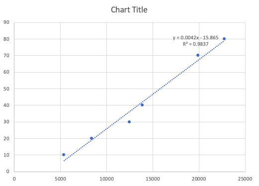
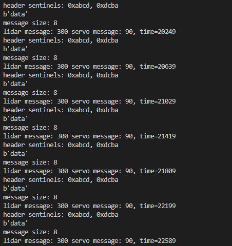
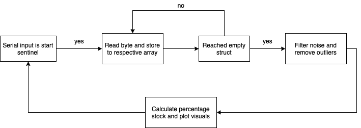
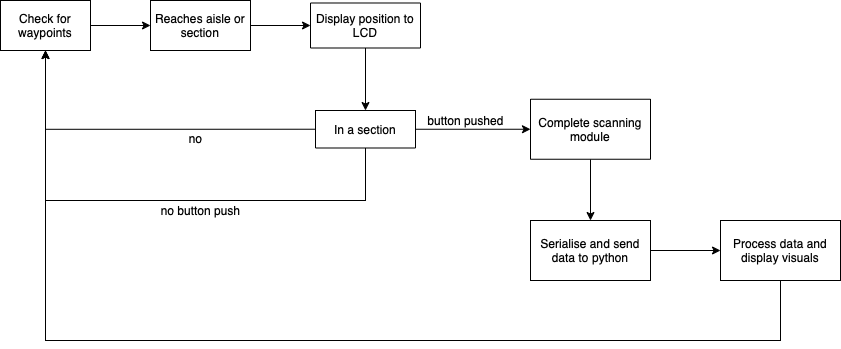

## Introduction

This project utilises the HCS12 Dragon board and the Pan and Tilt Unit (PTU) to create a proof-of-concept for a stock taking technology (the 'Stocktaker') which will assist to improve supermarket efficiency. The Stocktaker uses the dragon board to process LIDAR and magnometer readings collected from the PTU whilst also providing an opportunity for users to interface with the Stocktaker. The collected readings are then sent to a PC to be further processed and converted into visuals for a user. The Stocktaker also has an additional feature where it will play emergency noises if it is shaked abruptly which mimics someone trying to steal the HCS12.

The Stocktaker is able to provide the position (aisle and section) it is stocktaking and display this to the LCD, do a scan of the section and tell the user how full the shelf is as a percentage. A 3D point cloud will also be displayed so that the user can visualise how full the shelf is. The final design would place the dragon board and PCU on another robot which could move it through the supermarket automatically and scan shelves and send this collected data to another robot which would know where to refill stock.

## System Requirements

This system works to check the stock and location (aisle and section) where each section is 44cm wide by 50cm deep. The Stocktaker must move past waypoints (magnets) to check its location and once in the desired section must be placed 35cm from the front of the stock area by the user and the PH0 button must be pushed to begin the scanning for stock.

Other assumptions made in this project are that stock will be taken from the middle of each section.

## On Board Processing

### Magnometer

#### High Level Information
The magnometer has been utilised to identify a set of magnets with a changing magnetic field direction. When the stack of magnets is oriented in the vertical direction (x) it denotes the beginning or end of an aisle. When the magnets are placed horizontally (y) they represent a 1 meter section of that aisle. These magnets are counted each time the robot passes a waypoint allowing the program to interpret this information and display the relevant location to the LCD.  

#### User Instructions
Starting outside of all aisles, the user must first pass the stack of magnets passed the robot in a vertical orientation so that the entrance to an aisle is identified. From here the user can decide whether to continue to the next aisle or turn down the current aisle. Once inside an aisle the robot must pass and scan 4 seperate sections before returning to the waypoint that signifies the aisle entrance. To identify a section the user must pass the robot past a stack of magnets that are laying horizontally. 

#### Detailed Information
Through testing the magnometer we understood that by changing the orientation of a magnets poles relative to the device the magnometer can be saturated to a value of 240 in either X, Y or Z directions. Aware of this, magnets stacked vertically (X) were used to denote the entrance of an aisle while magnets placed horizontally (Y) signaled a section of the aisle. Initially, the robot has to pass a magnet that saturates in X then determine whether it wants to continue to the next vertical stack of magnets or turn into an aisle. Once in an aisle it has to pass all sections before returning to the vertical magnet stack at the aisle entrance.

#### Testing
Testing the magnometer was performed by passing a range of metals by the magnometer and checking to see if any unique values appeared. After not recieving any confident results we tried magnets which seemed to saturate the magnometer to a value of 240 depending on the orientation of the magnets. Aware that we can saturate the magnometer in specific directions we decided to utilise the X direction to denote aisles and the Y direction to denote sections of aisles. This concept was integrated into a program that updates the robots position and displays the location on the LCD, allowing the user to observe a simulated circuit of the store and test to see if the position is being updated correctly. 

### LCD
High Level Information
Each shelf has a magnet, and when the Stocktaker passes a shelf, it will count and display the shelf number and other information on the LCD.

#### User Instructions
In this module, the LCD is fully automated, and the user does not need any operation. When the Stocktaker passes through different shelves, the shelf number and percentage full will be automatically displayed on the LCD .

#### Detailed Information
As the Stocktaker walks through the shelves, each time a magnet is detected, the counter increases by one and the number is sent to the LCD. After scanning the shelf, after analyzing the data, it will send a number to the LCD, this number represents the percentage of the goods on the shelf to the shelf, and this percentage will also be displayed on the LCD.

#### Testing
This module has carried out several sets of tests, sending two sets of strings to the LCD, and the display and line wrapping functions of the LCD can be used normally.

### Scanning

#### High Level Information
	@@ -70,107 +59,71 @@ The scanning module includes the pan and tilt, the LIDAR and the position calcul

#### Calibration

The first task in the scanning module was to calibrate both the LIDAR and the pan and tilt parts of the PTU. This was done by keeping the PTU stationary and recording LIDAR readings for 1 second at different distances (10-80cm) as seen in Figure 1. The pan and tilt were also calibrated and 30 points for PWM corresponded to 1 degree.

##### Figure 1

The average LIDAR reading for each distance was then plotted against it's respective distance and linear relationship was derived between the two by using a line of best fit in Excel. This equation was then used to convert the inputed LIDAR readings into overall distances and this line of best fit and equation can be seen in Figure 2.

##### Figure 2

#### User Instructions

The PTU has already been coded to pan 32 degrees from either side of the center and tilt up once, so that points are received for two levels of each scan. The parsing is set up for the PTU to be placed 85cm from the back of the shelf and no closer than 35cm from the front of the stock and to scan an area which is 44cm wide by 58cm deep. As this has been set up the user only needs to push the PH0 button to begin the scan once the Stocktaker is in a section and is aligned correctly.

#### Detailed Information

As the calibration already produced angles and a total distance from each scan, after each scan the total distance could be converted to an X, Y and Z coordinate from the scanner. This was done with trigonometry and these could then be passed to the serialisation module.

#### Testing

This was tested in parts. A lot of testing was first done with the pan and tilt and the LIDAR readings in calibration. Averages were found and error was also checked for to create accurate conversions from raw data to distances and angles. Testing was also done throughout, and adjustments were made when there was systematic error.

### Serialisation

#### High Level Information

Serialisation in this project is aiming to pass data from the Dragonboard to PC, which uses python or matlab to handle these data and
do the visualisation later. This part consists of one C file for 'packing' and one python file to 'unpack' the data.

#### User Instructions

COM1 and COM10 are used in this module, no need to modify if unessrsary. Set the variables 'position' and 'degree' in C file to the data from sensors,
and then run the python file to read the data in terminal.

#### Detailed Information

The data will be packed in serial and sent via COM10 (in this project). On PC, one python programme will be used to unpack thoes data with some 
particular way. One header is used to indicate what types the data is and a specific data like gyro position or servo degree with a sentinel will
be read. 

#### Testing

There is no real data to do the test, therefore, 'position' and 'degree' were set to simple integers. Then verify the integer in terminal of the python program
if the same numbers show, it means the serialisation works.

##### Figure 3

### Theft Alarm

#### High Level Information

The alarm will be triggered when the stocktaker is moved abruptly. This will be triggered by the accelerometer readings and if they reach a certain bounds they will trigger emergency music to play.

#### User Instructions

The user will have to reset the Stocktaker after the emergency music is triggered, and rescue the Stocktaker if it has been stolen!

#### Detailed Information

Different frequencies will be played depending on the frequency at which Port T (the speaker) is turned on and off. Durations will also be inputted each time a note is played to determien how long the note is played for.

## External Processing

Python was chosen to process data on the PC because it is higher level and there were less constraints on memory off the dragon board.

### Input Parsing and Visualisation

#### High Level Information

After data is serialised and passed to the PC as a struct it is read in, and separated into separate elements to be added to their respective arrays. These separate arrays can then be used to plot the point cloud, calculate a percentage of stock available and display the area in which the Stocktaker checked stock.

#### Detailed Information

The code starts off in a while loop waiting until the start sentinel is read in. Once this is done eah byte is stored to an array, either X, Y or Z coordinate or position. These are then filtered using functions looking for too much variation or outliers (readings outside the stock area) and these are removed. Next the percentage of stock in the position needs to be calculated and first the arrays are sorted by the x-coordinates so that x-coordinate readings are incremental. Next, using the trapezoidal method and the x and y coordinates the area of occupied stock is calculated and from this the percentage of stock available is calculated. This logic is displayed in Figure 3.

##### Figure 4

The X, Y and Z coordinates are displayed in a point cloud using Matplotlib and plotting in 3D. The percentage of stock and position of the Stocktaker are then passed to a visuals function which utilises the Python image library (Pillow) for image and processing, PNG images of a background and masks for each position to display location and stock percentage to the user.

#### Testing

This was tested first in 2D, reading in X and Y coordinates and plotting them in 2D. Once this was done filters were added to remove noise and outliers, all the while plotting the final position coordinates to monitor the effectiveness of these functions. Finally the user visuals were added and tested with the rest of the external processing.

## Integration

#### Overall System Diagram

The overall system flow chart can be seen below in Figure 4. The data flows chronologically, first polling for a waypoint. Once a waypoint is reached this is sent to the LCD to be displayed to the user. Once a section is reached the button press is polled for and once this is pressed the polling stops and the scan involving the pan, tilt and LIDAR is completed and the data is put into structs to be sent to the external PC. This is then parsed and turned into visuals before the system begins to again poll for waypoints.

##### Figure 5

#### Testing

The whole system was tested in modules before integration. During integration there were various problems, including code being incompatible with other code and unexpected issues arising. These were tackled by taking a step back and the person working on the respective moddule completing sanity checks to ensure code could be incorporated. 

All code ended up being incorporated into the magnometer module though as this involved polling and had a spot to put the scan module and python parsing.

#### Discussion

Working with hardware and software was very difficult especially when some of the hardware was inconsistent at times (sensors stopping working due to an unstable ribbon connection) and the some serial data was getting lost when sent to the PC. The project was fun and challenging though and can now successfully scan for stock percentage and display this to a user.
